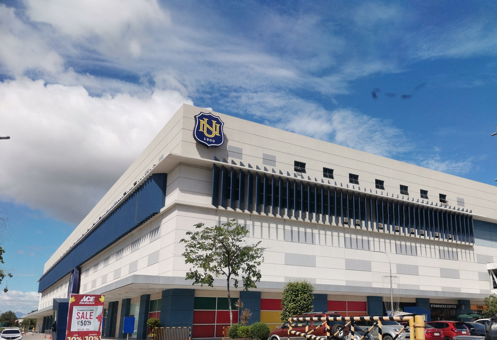

<!--  -->

  

 建校年份：1900 
 所在位置：马尼拉 
 学校类型：私立
 语言要求：雅思托福，或参加并通过语言课程 
 学校官网：www.national-u.edu.ph 
 学校地址：551 M.F. Jhocson St. Sampaloc, Manila, PH 1008
 国家大学（National University，简称NU）是菲律宾的优质大学之一，位于菲律宾首都马尼拉，成立于1900年8月1日，是全菲律宾第一所使用英语教学的民办非宗教的大学。国家大学是菲律宾高等教育协会的先驱成员，同时也是东南亚高等学校协会（ASAHIL和国际大学联合会（IAU）的一员。

SCHOOLMajors招生专业:
1.Master in Management 管理硕士
2.Master of Arts in Education major in  教育文学硕士，主修
3.English 英语
4.Educational Management  教育管理
5.Special Education 特殊教育
6.Master of Science in Computer Science 计算机科学理科硕士
7.Master in Information Systems 信息系统硕士
8.Master in Computer Science 计算机科学硕士
9.Master in Game Design 游戏设计硕士
10.Master in Computer Engineering 计算机工程硕士
11.Master in Information Technology 信息技术硕士
12.Master of Science in Sanitary Engineering 卫生工程理学硕士

     

博士研究生项目/Doctor Programs:
1.Doctor of Education major in Educational Management 教育学博士，主修教育管理
2.Doctor of Philosophy in Computer Science 计算机科学哲学博士
3.Doctor of Dental Medicine 牙科医学博士
4.Doctor of Optometry 验光博士

     

      

        SCHOOLSYSTEM学制时长:
        硕士：2年学制
        博士：3年学制

        Teachingmethods授课方式
        Applyrequirement申请要求
        【本升硕申请要求】

        ①学历：国家承认本科学历；

        ②语言：提交雅思托福成绩，或参加并通过语言课程

        

       【硕升博申请要求】

        ①学历：国家承认硕士学位；

        ②语言：提交雅思托福成绩，或参加并通过语言课程

        Applyfiles申请资料
        1. 个人简历

        2. 申请表

        3. 个人陈述(详见申请表格)

        4. 推荐信

        5. 出生证明书或结婚证明书影印本(如适用)

        6. 最高学历复印件、公证、双认证

        7. 成绩单、公证、双认证

        8. 无犯罪记录证明、公证、双认证

        9. 2张2* 2英寸的白底彩色证件照

        Enrollmenttime开学时间
        1月、7月、10月

